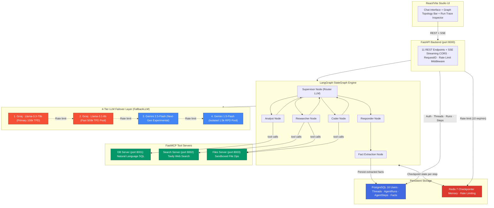

<p align="center">
  <strong>◈ OrqFlow</strong><br/>
  <em>Autonomous Multi-Agent AI Orchestration Platform</em>
</p>

<p align="center">
  
  
  
  
  
  
  
  
  
</p>

---

OrqFlow is a **production-grade autonomous multi-agent AI platform** where a LangGraph supervisor dynamically routes complex user tasks to specialist worker agents — Researcher, Analyst, Coder, and Responder — each equipped with real external tools via the Model Context Protocol (MCP).

Unlike typical LangChain chatbots that send a single prompt to an LLM, OrqFlow implements a complete agentic execution engine — from cyclic LangGraph state topologies and automated LLM failover to real-time SSE observability, Redis rate-limiting, and async PostgreSQL memory checkpointing. The system is validated by a **95-test regression suite** covering all system layers.

The platform integrates **FastMCP** for decoupled tool microservices, **Groq (Llama-3.3-70b)** as the primary inference engine with a **4-tier automatic fallback sequence** (`Groq 70B` $\rightarrow$ `Groq 8B` $\rightarrow$ `Gemini 2.5 Flash` $\rightarrow$ `Gemini 1.5 Flash`) across isolated model quota pools, and a **React/Vite studio UI** featuring live run trace inspection, interactive graph topology, and token-by-token streaming.

---

## Table of Contents

- [System Architecture](#system-architecture)
- [Agent Execution Pipeline](#agent-execution-pipeline)
- [What Makes This Different](#what-makes-this-different)
- [Project Structure](#project-structure)
- [Setup & Installation](#setup--installation)
- [Testing & Quality](#testing--quality)
- [Deployment](#deployment)
- [API Reference](#api-reference)
- [Technical Decisions](#technical-decisions)
- [Scope & Limitations](#scope--limitations)
- [Recommended Reading](#recommended-reading)

---

## System Architecture



---

## Agent Execution Pipeline

Every user message flows through a deterministic multi-step agentic execution pipeline:


| Workflow | Initiator | Execution | Result |
|---|---|---|---|
| **Agent Execution** | `POST /api/threads/{id}/run` | LangGraph cyclic StateGraph + 4-Tier FallbackLLM | Real-time SSE events: `node_start`, `token`, `tool_call`, `run_complete` |
| **Thread Management** | `POST /api/threads` | PostgreSQL `threads` table + UUID | Persistent conversation context across sessions |
| **Run Observability** | `GET /api/runs/{id}/trace` | `agent_steps` table (per-step latency, tool names) | Full execution trace for performance profiling |
| **Long-Term Memory** | Fact Extraction node | `AsyncPostgresStore` + user namespace | Cross-session domain facts stored and retrieved |
| **LLM Failover** | Any node invocation | `FallbackLLM.ainvoke()` sequential chain | Zero-downtime 4-tier model failover with user notice |

---

## What Makes This Different

| Concern | Typical Chatbot Approach | OrqFlow |
|---|---|---|
| **Multi-step reasoning** | Single prompt → single LLM reply | Cyclic LangGraph StateGraph — Supervisor routes, specialists act, graph loops until task completion |
| **LLM reliability** | Crashes when Groq hits quota | `FallbackLLM` wrapper transparently steps through a **4-tier sequential chain** (`Groq 70B` $\rightarrow$ `Groq 8B` $\rightarrow$ `Gemini 2.5 Flash` $\rightarrow$ `Gemini 1.5 Flash`) across isolated model quota pools on HTTP 429 |
| **Tool execution** | Functions hardcoded inside app process | 3 independent FastMCP microservices — isolated, independently scalable, MCP-standard compliant |
| **SQL injection via AI** | Agent sent raw user string as query | DB MCP server runs schema inspection first; queries validated before execution in the analyst node |
| **File path traversal** | AI writes anywhere on disk | Files MCP server enforces `os.path.abspath()` whitelist — no `../` escape from `/workspace` root |
| **Memory across sessions** | Stateless — each chat starts fresh | Redis checkpointer serializes full graph state after every node step; PostgreSQL `AsyncPostgresStore` persists extracted user facts |
| **AI observability** | Log lines in stdout | `StepRecorder` writes per-step latency, node name, tool name, and payload preview to `agent_steps` table |
| **Rate limiting** | Per-process in-memory counter | Redis sliding-window (ZSET timestamps) — shared correctly across all Uvicorn workers |
| **Deterministic testing** | Live API calls — slow, costly, flaky | `AsyncMock` replaces all LLM endpoints — **95 tests complete in ~12 seconds**, zero quota consumed |
| **Context routing** | All tasks go to the same LLM prompt | Supervisor uses `temperature=0` structured output to route to the correct specialist node |

---

## Robustness & Error Handling

To ensure enterprise-grade stability, OrqFlow implements several deep architectural fail-safes against common AI agent failure modes:

1. **Auto-FINISH Loop Prevention:** The Supervisor node inspects the most recent message. If a specialist just completed its task without requesting new tools, the Supervisor instantly short-circuits to the `Responder` node, preventing the LLM from hallucinating endless `Coder` $\leftrightarrow$ `Researcher` loops.
2. **Context Trimming:** Checkpointer history is strictly trimmed before being passed to `create_react_agent` (last 10 messages) and the Supervisor (last 6 messages). This prevents massive session history from confusing agents into re-executing old tool calls.
3. **Poisoned Session Auto-Healing:** The `StepRecorder` tracks SQLAlchemy asyncpg transaction health. If a DB write fails (e.g., due to an LLM timeout connection drop), the recorder automatically destroys and recreates the session factory, preventing cascading `InvalidTransaction` errors.
4. **Smart Fallback Triggers:** The `FallbackLLM` only cascades to weaker models on true HTTP 429 rate limits or 50x server errors. Normal LLM structured output parsing errors (`json`, `validation`) are surfaced immediately without wasting the 4-tier timeout chain.
5. **SSE Model Switch Notifications:** When the `FallbackLLM` triggers a model switch (e.g., Groq 70B runs out of tokens), a custom LangGraph event is dispatched. The React frontend intercepts this and injects an inline `⚡ Model Switch:` warning directly into the user's chat bubble.

---

## Project Structure

```
OrqFlow/
├── app/
│   ├── __init__.py
│   ├── main.py                    # FastAPI app factory + lifespan (graph init)
│   ├── config.py                  # Pydantic BaseSettings (env validation)
│   ├── models.py                  # SQLAlchemy ORM: User, Thread, AgentRun, AgentStep
│   ├── database.py                # Async SQLAlchemy engine + session factory
│   ├── auth.py                    # JWT creation, password hashing (bcrypt)
│   ├── dependencies.py            # get_current_user, get_db (FastAPI Depends)
│   ├── errors.py                  # AppError + global exception handlers
│   ├── recorder.py                # StepRecorder: per-step latency + observability writes
│   ├── middleware/
│   │   ├── request_id.py          # X-Request-ID propagation for log correlation
│   │   └── rate_limit.py          # Redis sliding-window rate limiter (10 req/min)
│   ├── routers/
│   │   ├── auth_router.py         # /api/auth/register, /api/auth/login, /api/auth/refresh
│   │   ├── agent_router.py        # /api/threads, /api/runs, /api/facts, /api/mcp/health
│   │   └── health.py              # /health (system status)
│   └── graph/
│       ├── state.py               # AgentState TypedDict schema
│       ├── builder.py             # StateGraph construction (nodes + edges)
│       ├── nodes.py               # Supervisor, Researcher, Analyst, Coder, Responder, Extractor
│       ├── fallback.py            # FallbackLLM: Groq → Gemini auto-switch
│       ├── memory.py              # Redis checkpointer + Postgres long-term store factory
│       ├── tools.py               # MCP client tool loader (load_agent_tools)
│       └── prompts.py             # System prompts per specialist agent
├── mcp_servers/
│   ├── db_server.py               # FastMCP: natural language SQL + schema inspection
│   ├── search_server.py           # FastMCP: Tavily web search + result sanitization
│   ├── files_server.py            # FastMCP: sandboxed file read/write/list (workspace jail)
│   └── shared_auth.py             # Internal service token validation
├── frontend/
│   └── src/
│       ├── App.tsx                # Studio UI: chat, topology bar, run trace inspector
│       └── components/            # Reusable UI components
├── alembic/
│   ├── env.py                     # Async Alembic migration runner
│   └── versions/                  # Incremental schema migration scripts
├── tests/
│   ├── test_agent.py              # LangGraph routing + FallbackLLM tests (6 tests)
│   ├── test_auth.py               # JWT, session isolation, hashing tests (14 tests)
│   ├── test_graph.py              # StateGraph topology + conditional edges (13 tests)
│   ├── test_health.py             # Endpoint health checks (4 tests)
│   ├── test_mcp_db.py             # DB MCP: SQL validation + injection guards (20 tests)
│   ├── test_mcp_files.py          # Files MCP: traversal protection + ops (18 tests)
│   └── test_mcp_search.py         # Search MCP: payload sanitization (11 tests)
├── scripts/                       # Utility scripts: seed users, test endpoints, etc.
├── Dockerfile                     # Multi-target: api + mcp server images
├── docker-compose.yml             # Full stack: api, frontend, mcp-db/search/files, postgres, redis
├── alembic.ini                    # Alembic configuration
├── requirements.txt               # Python dependencies
└── pytest.ini                     # Pytest configuration (asyncio mode = auto)
```

---

## Setup & Installation

### Prerequisites
- **Python 3.11+**
- **Docker & Docker Compose**
- **Node.js 20+** (for the React frontend)

### Step-by-Step

```powershell
# 1. Clone the repository
git clone https://github.com/Akshansh0519/OrqFlow.git
cd OrqFlow

# 2. Configure environment variables
copy .env.example .env
# Add your GROQ_API_KEY, GOOGLE_API_KEY, and TAVILY_API_KEY in .env

# 3. Launch infrastructure (PostgreSQL + Redis)
docker compose up -d postgres redis

# 4. Install Python dependencies
pip install -r requirements.txt

# 5. Apply database migrations
alembic upgrade head

# 6. Start the 3 FastMCP tool servers (separate terminals)
python -m mcp_servers.db_server      # port 8001
python -m mcp_servers.search_server  # port 8002
python -m mcp_servers.files_server   # port 8003

# 7. Start the FastAPI backend
uvicorn app.main:app --reload        # port 8000

# 8. Start the React Studio UI (separate terminal)
cd frontend && npm install && npm run dev   # port 5173
```

### Docker Compose (Full Stack)
```powershell
# Spin up the entire stack with a single command
docker compose up --build

#OR

# open docker desktop
# docker compose up -d postgres redis api mcp-db mcp-search mcp-files
# cd frontend
# npm run dev


```
This launches: **FastAPI API**, **React frontend**, **3 MCP servers** (db, search, files), **PostgreSQL 16**, and **Redis 7** — all networked together.

---

## Deployment

See [docs/deployment.md](docs/deployment.md) for the practical deployment guide,
Docker smoke-test commands, production environment variables, and portfolio-demo
checklist.

---

## Testing & Quality

OrqFlow includes a comprehensive automated regression suite validating all system layers.

```powershell
# Run the complete 95-test suite
pytest

# Run isolated layer tests
pytest tests/test_agent.py      # LangGraph routing + failover
pytest tests/test_mcp_db.py     # SQL injection guards
pytest tests/test_auth.py       # JWT session isolation
```

### Test Suite Breakdown

| File | Tests | Coverage |
|---|---|---|
| `test_mcp_db.py` | 23 | SQL query execution, schema inspection, injection prevention |
| `test_mcp_files.py` | 18 | File read/write/list, directory traversal protection |
| `test_graph.py` | 13 | StateGraph edges, supervisor routing, state reducers |
| `test_mcp_search.py` | 11 | Tavily payload validation, timeout handling |
| `test_auth.py` | 14 | JWT creation/expiry, bcrypt hashing, session isolation |
| `test_agent.py` | 8 | Agent API, SSE streaming, cross-user access protection |
| `test_mcp_auth.py` | 4 | Shared MCP bearer token validation |
| `test_health.py` | 4 | FastAPI, PostgreSQL, Redis health checks |
| **Total** | **95** | **All layers** |

All 95 tests use mocks or local fixtures where needed to avoid live LLM quota usage.

### Static Analysis
```powershell
# Should return nothing — no hardcoded secrets
grep -r "api_key\s*=" app/ --include="*.py"

# Should return nothing — no blocking sync DB calls inside async routes
grep -r "session.execute(" app/routers/ --include="*.py"

# Should return nothing — no raw string SQL (injection vector)
grep -r "f\"SELECT" app/ --include="*.py"
```

---

## API Reference

### REST Endpoints

| Method | Endpoint | Auth | Description |
|---|---|---|---|
| `GET` | `/health` | Public | System health check (API, DB, Redis) |
| `POST` | `/api/auth/register` | Public | Register user, returns JWT token pair |
| `POST` | `/api/auth/login` | Public | Authenticate user, returns JWT token pair |
| `POST` | `/api/auth/refresh` | Public | Rotate expired access token |
| `POST` | `/api/threads` | Bearer | Create a new conversation thread |
| `GET` | `/api/threads` | Bearer | List all threads for the current user |
| `POST` | `/api/threads/{id}/run` | Bearer | Execute the agent graph, stream SSE events |
| `GET` | `/api/threads/{id}/trace` | Bearer | Fetch full message history from checkpointer |
| `GET` | `/api/runs/{id}/trace` | Bearer | Fetch per-step observability rows from `agent_steps` |
| `GET` | `/api/facts` | Bearer | List long-term memory facts for the user |
| `DELETE` | `/api/users/me/facts/{key}` | Bearer | Delete a specific long-term memory fact |
| `GET` | `/api/mcp/health` | Bearer | Check health of all 3 FastMCP servers |

### SSE Event Contract (`POST /api/threads/{id}/run`)

**Server → Client Events**
| Event | Payload |
|---|---|
| `node_start` | `{ run_id, node, step_index, ts }` |
| `routing` | `{ run_id, next_agent, reasoning }` |
| `token` | `{ run_id, node, token }` |
| `tool_call` | `{ run_id, tool_name, arguments, ts }` |
| `tool_result` | `{ run_id, tool_name, result, ts }` |
| `node_end` | `{ run_id, node, step_index, latency_ms, ts }` |
| `run_complete` | `{ run_id, total_steps, total_latency_ms }` |
| `done` | `{ status: "completed", run_id }` |
| `error` | `{ run_id, message, error }` |

---

## Technical Decisions

| Decision | Rationale |
|---|---|
| **Cyclic StateGraph over linear chains** | Single-shot prompts fail on multi-step tasks. LangGraph cycles let the Supervisor re-evaluate after each specialist and dynamically determine the next action until the goal is achieved. |
| **FallbackLLM wrapper over hard-coded provider** | Free and pro LLM tiers enforce strict daily token limits. Wrapping both providers in a unified `Runnable` interface ensures zero-downtime execution when Groq returns HTTP 429. |
| **FastMCP microservices over inline `@tool` decorators** | Standard LangChain `@tool` decorators bind functions inside the main process. MCP decouples tools into independent servers — each independently restartable, testable, and scalable. |
| **`os.path.abspath()` whitelist in Files MCP** | Without path validation, an AI agent could craft a `../../../etc/passwd` path request. Enforcing workspace root containment prevents directory traversal attacks at the OS level. |
| **`temperature=0` for all routing LLMs** | JSON tool-call arguments require deterministic token selection. Sampling with temperature > 0 causes malformed argument payloads and unpredictable routing paths. |
| **Redis checkpointer over in-memory `MemorySaver`** | In-memory state is lost on server restart. Redis checkpointing serializes the full graph state dict after every node step, enabling session resumption and time-travel debugging. |
| **`AsyncPostgresStore` for long-term facts** | Per-session Redis memory is volatile. Extracted domain facts (e.g., user preferences, domain entities) are written to PostgreSQL for permanent, cross-session retrieval. |
| **`StepRecorder` per-run observability** | Knowing which node took the most time and which tools were called is essential for performance profiling. The recorder writes exact per-step latency to `agent_steps` for post-run analysis. |
| **Mocked LLMs in tests** | Running tests against live LLM APIs is slow (~2–10s per call), costs quota, and produces non-deterministic results. Mocking gives fast deterministic test feedback. |

---

## Scope & Limitations

> **Transparency note:** This is a portfolio project demonstrating production-grade backend AI engineering depth, not a deployed SaaS product.

- **Single Redis instance.** Redis currently handles both LangGraph checkpointing and rate limiting. A production deployment requires Redis Cluster or Sentinel for high availability.
- **No streaming tool execution.** Tool call results are returned as a complete payload. Long-running DB queries or file reads block the specialist node until completion.
- **MCP servers lack mutual TLS.** Inter-service communication between the orchestrator and FastMCP servers uses shared secret tokens, not full mTLS. Production deployment requires certificate-based service mesh authentication.
- **No agent-level concurrency.** The LangGraph graph executes nodes sequentially. Parallel agent dispatch (running Researcher and Analyst simultaneously) is architecturally possible with LangGraph's `send_all` API but not yet implemented.
- **Frontend is a studio, not a SaaS.** The React UI is a local developer observability dashboard. It lacks multi-tenant user management, subscription billing, or mobile responsiveness.

---

## Recommended Reading

1. ⭐⭐⭐ **LangGraph Multi-Agent Architectures**
   [LangGraph Supervisor Pattern Documentation](https://langchain-ai.github.io/langgraph/tutorials/multi_agent/agent_supervisor/)
2. ⭐⭐⭐ **Model Context Protocol Standard**
   [MCP Official Specification](https://modelcontextprotocol.io/introduction)
3. ⭐⭐ **ReAct: Reasoning and Acting in Language Models**
   [ReAct Paper (Yao et al., 2022)](https://arxiv.org/abs/2210.03629)
4. ⭐⭐⭐ **Server-Sent Events vs WebSockets**
   [MDN SSE Documentation](https://developer.mozilla.org/en-US/docs/Web/API/Server-sent_events)
5. ⭐⭐ **FastAPI Async Best Practices**
   [FastAPI Concurrency and async/await](https://fastapi.tiangolo.com/async/)
6. ⭐⭐ **Redis Sorted Sets for Rate Limiting**
   [Redis Sliding Window Rate Limiting Pattern](https://redis.io/glossary/rate-limiting/)

---

<p align="center">
  Built with intention by <strong>Akshansh Ranjan</strong>
</p>
